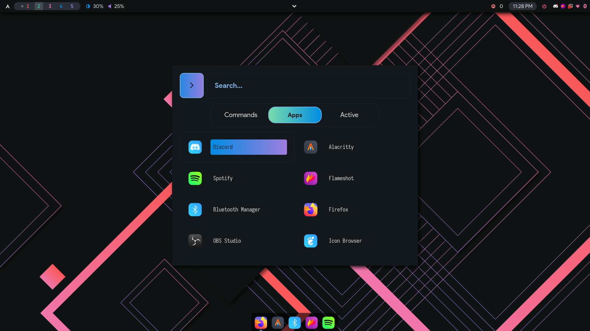
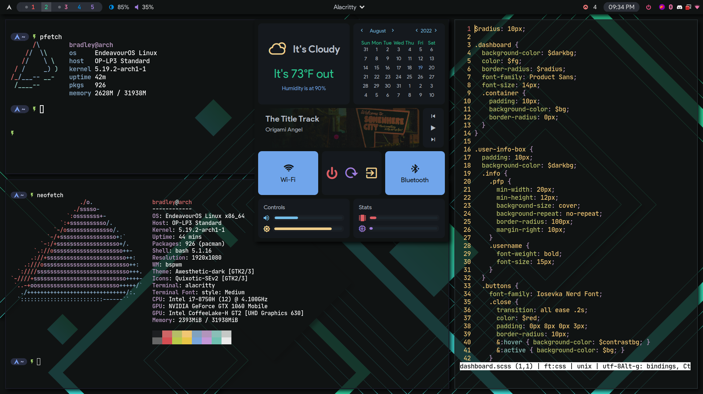

# dotfiles

## Info
Only tested on a 1920x1080 display, you may run into issues with eww if using another resolution. You will have to use a openweathermap key in [weather.sh](https://github.com/skearya/dots/blob/v2/.config/eww/scripts/weather.sh ) for weather to work, more info commented in file.

- **OS:** [Endeavour](https://endeavouros.com/)
- **Window Manager**: [bspwm](https://github.com/baskerville/bspwm)
- **Terminal:** [alacritty](https://github.com/alacritty/alacritty)
- **Compositor:** [picom-jonaburg-git](https://github.com/jonaburg/picom)
- **Application Launcher:** [rofi](https://github.com/davatorium/rofi)
- **Dock:** [Plank](https://launchpad.net/plank)
- **Colorscheme:** [Quixotic](https://github.com/QuixoticCS/)
- **Wallpaper:** [Quixotic Wallpapers](https://github.com/QuixoticCS/quixotic-wallpaper)
- **GTK:** [Awesthetic](https://github.com/saimoomedits/dotfiles/blob/main/extras/themes)
- **Fonts:** JetBrains Mono Nerd Font, Material Design Icons, Product Sans
- **Icon Theme:** [Quixotic-SEv2](https://github.com/QuixoticCS/quixotic-icons)
***
*Credits*
---
- **Polybar Inspiration**: [Siduck's Bar](https://github.com/siduck/dotfiles)
- **Original Rofi Theme**: [Dharmx's Rofi](https://github.com/dharmx/dots.sh/tree/main/config/_ui/rofi)
- **eww Dashboard Base**: [AlphaTechnolog](https://github.com/AlphaTechnolog/)
- **Starship Config**: [syndrizzle's hotfiles](https://github.com/syndrizzle/hotfiles/tree/fvwm)
***

